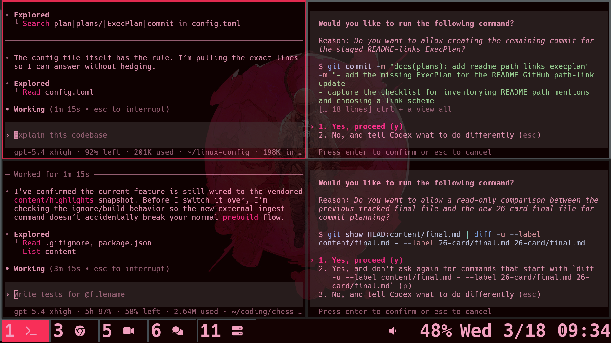

# KM's Four-Codex Operating Environment

This repo does not just configure Linux. It configures how
AI-assisted engineering runs. Under the usual `chezmoi` dotfiles
surface is a tracked operating layer for Codex: AGENTS files, runtime
defaults, reusable local skills, Graphiti-backed memory, and ExecPlans
designed for parallel terminal-agent work.

For recruiters and AI-native engineers, the point is concrete: this
repo is a public artifact of how I structure leverage. It shows
planning before edits, small reversible diffs, reproducible setup,
durable context across sessions, and verification before claiming work
is done.

<p align="center">
  
</p>

## Tech Stack And Why Chosen

| Layer | Repo evidence | Why chosen |
| --- | --- | --- |
| `chezmoi` | [`dot_config/chezmoi/chezmoi-template.toml.tmpl`](dot_config/chezmoi/chezmoi-template.toml.tmpl) | Keeps the environment reproducible across machines instead of trapping setup inside one laptop. |
| Codex CLI and tracked config | [`dot_codex/config.toml`](dot_codex/config.toml) | Versions model, reasoning, trust, MCP, and session defaults so new Codex panes start from repo policy instead of memory. |
| AGENTS instruction chain | [`AGENTS.md`](AGENTS.md), [`AGENTS.repo.md`](AGENTS.repo.md), and [`dot_codex/AGENTS.md`](dot_codex/AGENTS.md) | Turns planning, verification, commit hygiene, and docs sync into inspectable workflow rules. |
| Local skills | [`dot_agents/skills/`](dot_agents/skills/) and [`dot_agents/skills/README.md`](dot_agents/skills/README.md) | Packages recurring jobs into reusable local capabilities instead of re-explaining the same workflows in every session. |
| Graphiti MCP with Neo4j | [`dot_codex/config.toml`](dot_codex/config.toml), [`scripts/executable_codex`](scripts/executable_codex), and [`docs/graphiti-mcp-codex.md`](docs/graphiti-mcp-codex.md) | Adds a retrievable memory layer for multi-session work where provenance and evolving context matter. |
| Shell and terminal tooling | [`dot_config/fish/config.fish.tmpl`](dot_config/fish/config.fish.tmpl), [`dot_tmux.conf`](dot_tmux.conf), [`dot_config/kitty/kitty.conf`](dot_config/kitty/kitty.conf), and [`dot_config/i3/config.tmpl`](dot_config/i3/config.tmpl) | Optimizes for terminal-first execution and multiple parallel panes instead of a single-editor workflow. |
| Python and Bash automation | [`scripts/`](scripts/) and [`dot_config/fish/functions/refresh-config.fish`](dot_config/fish/functions/refresh-config.fish) | Keeps repeatable operations small, inspectable, and version-controlled instead of burying them in chat or muscle memory. |

## Table Of Contents

- [Workflow At A Glance](#workflow-at-a-glance)
- [AI Layer Highlights](#ai-layer-highlights)
- [Core Components](#core-components)
- [Graphiti Memory Layer](#graphiti-memory-layer)
- [Install And Bootstrap](#install-and-bootstrap)
- [How To Use It](#how-to-use-it)
- [Core Command Reference](#core-command-reference)
- [Reproducibility Through Chezmoi](#reproducibility-through-chezmoi)
- [Rest Of Repo](#rest-of-repo)
- [License](#license)

## Workflow At A Glance

The screenshot above is the workflow. The most distinctive part of this
repo is the tracked operating surface highlighted by the left-side tree:

```text
AGENTS.md
AGENTS.repo.md
dot_codex/
dot_agents/
plans/
```

Those paths define how the AI layer behaves:

- [`AGENTS.md`](AGENTS.md) is the shared baseline for assistants.
- [`AGENTS.repo.md`](AGENTS.repo.md) points Codex to the repo-specific
  source of truth.
- [`dot_codex/AGENTS.md`](dot_codex/AGENTS.md) is the canonical merged
  instruction document that pushes Codex toward plan-first,
  verification-heavy engineering behavior.
- [`dot_codex/config.toml`](dot_codex/config.toml) tracks model,
  reasoning, trust boundaries, MCP servers, and repo-specific developer
  instructions.
- [`dot_agents/skills/`](dot_agents/skills/) packages recurring work
  into reusable local capabilities.
- [`plans/`](plans/) is where non-trivial work becomes explicit,
  checklisted, and reviewable.

## AI Layer Highlights

The interesting changes in this repo are often workflow upgrades, not
just dotfile tweaks. The current operating surface has a few
high-leverage properties:

- Instruction-chain upgrades can tighten planning, bug-fix discipline,
  documentation rules, and verification requirements across every new
  Codex session.
- Tracked runtime defaults in [`dot_codex/config.toml`](dot_codex/config.toml)
  change how new sessions start without requiring re-prompting.
- Skill growth in [`dot_agents/skills/`](dot_agents/skills/) turns
  repeated prompting into reusable local tools for shipping, research,
  browser automation, design work, docs lookup, and media tasks.
- The Graphiti MCP layer gives Codex a local temporal memory surface
  for longer-running, multi-session work.
- The README gate itself is versioned: the repo includes a
  recruiter-first sync skill that forces the public docs to keep pace
  with setup, usage, command flags, and repo positioning.
- Non-trivial work is expected to move through tracked plans instead of
  disappearing into chat scrollback.

## Core Components

### 1. Instruction Chain

[`AGENTS.md`](AGENTS.md), [`AGENTS.repo.md`](AGENTS.repo.md), and
[`dot_codex/AGENTS.md`](dot_codex/AGENTS.md) are the behavioral
backbone.

- [`AGENTS.md`](AGENTS.md) holds the shared baseline.
- [`AGENTS.repo.md`](AGENTS.repo.md) says
  [`dot_codex/AGENTS.md`](dot_codex/AGENTS.md) is authoritative for
  Codex in this repo.
- [`dot_codex/AGENTS.md`](dot_codex/AGENTS.md) is the canonical working
  document for this codebase.

That canonical document is not generic philosophy. It encodes concrete
engineering behavior:

- Plan mode for non-trivial work so larger tasks move through explicit
  steps, assumptions, risks, and verification.
- Failing reproducers before bug fixes so changes are grounded in
  observed behavior instead of guesswork.
- Explicit verification before done so completion is demonstrated with
  tests, diffs, logs, or clear manual checks.
- Docs updates with behavior changes so README, plans, setup steps, and
  workflows stay truthful.
- Small reversible diffs so changes remain reviewable and easy to back
  out.
- Conventional Commit discipline so commit history communicates intent
  clearly.
- A concrete definition of done so another engineer can verify the
  result without reverse-engineering the whole session.

This is where agent behavior stops being prompt folklore and becomes
versioned repo policy.

### 2. Tracked Codex Defaults

[`dot_codex/config.toml`](dot_codex/config.toml) makes each Codex
session start strong instead of neutral.

It tracks:

- the default model and reasoning effort
- trusted local project paths
- MCP servers
- notification and status-line preferences
- repo-specific developer instructions for plan and commit hygiene

That matters because a new Codex pane inherits the same defaults
immediately. No re-briefing. No guesswork.

One concrete example is the repo-local Graphiti MCP entry: Codex can
launch the local Graphiti checkout over `stdio`, while the detailed
setup and validation workflow lives in
[`docs/graphiti-mcp-codex.md`](docs/graphiti-mcp-codex.md).

### 3. Reusable Local Skills

[`dot_agents/skills/`](dot_agents/skills/) turns repeated prompting into
reusable capabilities. The full inventory lives in
[`dot_agents/skills/README.md`](dot_agents/skills/README.md), but the
main categories are more interesting than a flat list.

#### Git Workflow

Representative highlights:

- [`commit-plan`](dot_agents/skills/commit-plan/SKILL.md) turns a dirty
  worktree into a clean commit plan without staging or rewriting
  history.
- [`commit-session`](dot_agents/skills/commit-session/SKILL.md) ships
  only the files owned by the current Codex session, with fallback logic
  when a session missed its pre-write baseline.
- [`gh-fix-ci`](dot_agents/skills/gh-fix-ci/SKILL.md) investigates
  failing GitHub Actions checks and plans the fix before touching code.

This category matters because the repo stores reusable guardrails for
commit hygiene, session scoping, CI repair, and shipping discipline,
not just aliases or workflow notes.

#### Design And Frontend

Representative highlights:

- [`design-taste-frontend`](dot_agents/skills/design-taste-frontend/SKILL.md)
  generates React and Next.js interfaces with stronger art direction and
  motion than default LLM UI output.
- [`high-end-visual-design`](dot_agents/skills/high-end-visual-design/SKILL.md)
  pushes interfaces toward agency-grade typography, spacing, card
  treatment, and animation quality.
- [`redesign-existing-projects`](dot_agents/skills/redesign-existing-projects/SKILL.md)
  upgrades existing sites or apps in place without throwing away the
  current framework or functionality.

This category matters because it turns design direction into a
repeatable local capability instead of a one-off prompting exercise.

#### Research And Output Control

Representative highlights:

- [`feedback-memory`](dot_agents/skills/feedback-memory/SKILL.md)
  carries forward durable user corrections through a repo-tracked
  `feedback.log`.
- [`readme-recruiter-sync`](dot_agents/skills/readme-recruiter-sync/SKILL.md)
  hard-gates commit workflows on a README that is still truthful about
  install, usage, command flags, stack rationale, and recruiter-facing
  value.
- [`openai-docs`](dot_agents/skills/openai-docs/SKILL.md) answers
  OpenAI product and API questions from current official docs first.

This category matters because it makes repository knowledge,
documentation quality, and output discipline persistent instead of
fragile session state.

#### Browser And Desktop Automation

Representative highlights:

- [`playwright`](dot_agents/skills/playwright/SKILL.md) drives a real
  browser from the terminal for navigation, screenshots, extraction, and
  UI debugging.
- [`playwright-interactive`](dot_agents/skills/playwright-interactive/SKILL.md)
  keeps a Playwright browser session alive for faster repeated inspection
  and debugging passes.
- [`screenshot`](dot_agents/skills/screenshot/SKILL.md) handles
  desktop-level capture when a normal browser tool cannot grab the right
  evidence.

This category matters because terminal-first agent work still needs
direct access to browser state and desktop evidence when text-only
inspection is not enough.

#### Documents And Media

Representative highlights:

- [`imagegen`](dot_agents/skills/imagegen/SKILL.md) runs image
  generation and editing workflows through the OpenAI Image API.
- [`pdf`](dot_agents/skills/pdf/SKILL.md) handles PDF reading,
  generation, and review workflows where rendered layout matters as much
  as extracted text.
- [`transcribe`](dot_agents/skills/transcribe/SKILL.md) converts speech
  from audio or video into text with optional diarization and
  known-speaker hints.

This category matters because the repo packages higher-friction media
workflows as inspectable local tools instead of leaving them as ad hoc
prompts.

Several skills also include `SOURCE.md`, helper scripts, reference
material, or agent metadata. That makes them closer to local tools than
to copied prompt snippets.

### 4. ExecPlans

[`plans/`](plans/) is where non-trivial work stays explicit.

A representative plan such as
[`plans/commit-all-dirty.md`](plans/commit-all-dirty.md) does not just
say "commit the changes." It inventories the dirty worktree, groups
changes into coherent commit boundaries, notes partial-staging concerns,
defines verification after each step, and calls out concrete risks.

That is execution discipline you can inspect.

The point of keeping plans in the repo is simple: larger tasks should
not live only in chat scrollback or memory.

### 5. Four Codex Workflow

The operating model is four Codex sessions in parallel, each with a
distinct job:

1. Exploration: read the codebase, trace behavior, inspect docs, and
   surface constraints before editing.
2. Implementation: make focused code changes once the path is clear.
3. Review and refinement: look for regressions, weak assumptions, and
   cleaner solutions.
4. Verification and docs: run tests, validate behavior, and keep
   documentation or plans aligned with the work.

This split only works because every pane inherits the same instruction
chain, config defaults, trust rules, and reusable skills. The result is
parallelism with less chaos.

## Graphiti Memory Layer

Graphiti is the memory and retrieval layer that sits beside the repo's
instruction chain, local skills, and ExecPlans. In this setup it is not
just a theoretical fit. It is a local MCP service that helps Codex keep
longer-running work coherent across sessions.

The practical use case is straightforward:

- preserve evolving facts about tasks, services, files, branches, and
  verification state instead of leaving them buried in chat scrollback
- keep provenance back to the source episodes that produced those facts
- support multi-session Codex work where exploration, implementation,
  review, and docs all need the same durable context

The local setup is intentionally repo-specific. Instead of relying on
Graphiti's default HTTP transport, the working config launches Graphiti
over `stdio` from `/home/kevin/coding/graphiti/mcp_server`, keeps
runtime settings in that checkout's `.env`, and expects Neo4j on
`localhost:7687`. That keeps the Codex-side config small and avoids the
host-port `8000` collision that already exists on this machine.

The repo-level `codex` wrapper also starts the same Graphiti command in
the background before handing off to the real Codex CLI. That sidecar
is useful for making sure the command is already alive when you launch
Codex, but it does not replace the actual stdio MCP child that Codex
spawns for tool communication.

For the plain dotfiles bootstrap path, Graphiti is not required. For
the repo's tracked `codex` launcher, it is part of the documented AI
operating path.

The detailed setup, validation steps, and troubleshooting notes live in
[`docs/graphiti-mcp-codex.md`](docs/graphiti-mcp-codex.md). The short
version is:

1. Keep Neo4j running on `localhost:7687`.
2. Let Codex launch Graphiti through the `graphiti` MCP entry in
   [`dot_codex/config.toml`](dot_codex/config.toml).
3. Use Graphiti as the temporal memory layer that complements AGENTS
   files, skills, and ExecPlans instead of replacing them.

## Install And Bootstrap

The minimum bootstrap path is `git` plus `chezmoi`.

If you want to use the repo's local AI operating layer, install OpenAI's
Codex CLI separately first and make sure the real `codex` binary is on
`PATH`. The official starting point is the OpenAI Codex docs:
<https://platform.openai.com/docs/codex>.

If you want the repo's AI operating layer as documented here, add Codex
CLI plus the Graphiti-backed prerequisites that the tracked `codex`
launcher expects: a local Graphiti checkout and Neo4j reachable on
`localhost:7687`.

```bash
git clone https://github.com/Kevin-Mok/ai-cli-dotfiles.git
cd ai-cli-dotfiles

# Preview what this repo would write into $HOME
chezmoi -S "$PWD" diff

# Apply the tracked source state from this clone
chezmoi -S "$PWD" apply
```

That apply path also follows the native-discovery install flow for
[`obra/superpowers`](https://github.com/obra/superpowers): `chezmoi`
clones it to `~/.codex/superpowers` and writes
`~/.agents/skills/superpowers` as a symlink to its `skills/` directory.

To use the AI layer after the dotfiles are in place, run the
repo-managed wrapper directly, or make sure it is the `codex` command
that wins on your `PATH`:

```bash
"$HOME/scripts/codex"
```

The tracked wrapper is installed from
[`scripts/executable_codex`](scripts/executable_codex). It ensures the
Graphiti startup command
`uv run main.py --transport stdio --database-provider neo4j --model qwen3:14b`
is already running in the background before it hands off to the real
Codex CLI.

## How To Use It

Treat this repository as the source of truth for the environment rather
than editing live files under `$HOME` directly.

1. Edit the tracked source files in this repo.
2. Preview the resulting home-directory diff with
   `chezmoi -S "$PWD" diff`.
3. Run `refresh-config` after config changes when you want the repo, the
   tracked Codex config, chezmoi-managed files, and generated shortcuts
   brought back into sync in one step.
4. Apply changes with `chezmoi -S "$PWD" apply` when you want the direct
   chezmoi path instead of the higher-level refresh helper.
5. Run the repo-managed `codex` wrapper from the repo root when you want
   the tracked AGENTS chain, Codex config, local skills, and plans to
   shape the session.
6. Keep the root `README.md` aligned whenever the repo's public workflow
   changes, especially for install steps, usage, command flags, the
   repo-based tech stack section, and recruiter-facing positioning.

## Core Command Reference

These are the core entrypoints the README depends on. The flags and
options listed below are verified against local CLI help or script
source in this repo.

| Command | When to use it | Flags and options that matter |
| --- | --- | --- |
| `chezmoi -S "$PWD" diff` | Preview what the checked-out source tree would change in `$HOME`. | `-S` / `--source` points chezmoi at this clone instead of the default source directory. `--reverse` flips the diff direction when you need the comparison the other way around. |
| `chezmoi -S "$PWD" apply -n -v` | Dry-run an apply with extra detail before touching files in `$HOME`. | `-S` / `--source` uses this repo as the source state. `-n` / `--dry-run` previews changes without writing them. `-v` / `--verbose` prints more detail. |
| `chezmoi -S "$PWD" apply` | Apply the tracked source state from this clone into `$HOME`. | `-S` / `--source` uses this repo as the source state. `-P` / `--parent-dirs` is useful when you apply a nested target and also want its parent directories handled. |
| `refresh-config` | Reapply tracked repo configuration after changes to the environment layer. | No user-facing flags. It reapplies the tracked Codex config, runs `chezmoi apply`, syncs shortcuts, and reloads fish. |
| `"$HOME/scripts/codex"` or `codex` when that wrapper wins on `PATH` | Start Codex in the repo so the tracked instruction chain and config take effect. The repo wrapper also ensures the Graphiti sidecar command is running first. | `-C` / `--cd` sets the repo root when you launch from another directory. `--search` enables live web search for tasks that need current external information. `CODEX_WRAPPER_GRAPHITI_CWD` and `CODEX_WRAPPER_STATE_DIR` override the wrapper's Graphiti checkout path and state directory. |
| `codex mcp list --json` | Verify which MCP servers Codex is loading from the tracked config. | `--json` emits machine-readable output that is easier to inspect or diff. |

## Reproducibility Through Chezmoi

The productivity gain is not trapped inside one laptop.

This repo is `chezmoi`-managed, which means the environment itself is
tracked as source state and can be applied back into `$HOME` through the
standard `chezmoi` workflow. The same files that shape the Codex
workflow, including AGENTS documents, Codex config, skills, aliases,
templates, and supporting dotfiles, are part of a reproducible setup
rather than fragile local state.

That means the workflow is portable when the setup changes, and the
leverage is inspectable because you can see exactly which instructions,
defaults, packaged skills, and plans are doing the work.

Typical commands are still the usual ones:

```bash
chezmoi -S "$PWD" diff
chezmoi -S "$PWD" apply
```

The difference is what is being reproduced. It is not only shell
comfort. It is the operating environment for AI-assisted engineering.

## Rest Of Repo

The rest of the repository is still a full desktop-dotfiles setup, not
just an AI CLI config repo. The major non-AI surfaces break down like
this.

### Shells And Shared Shortcuts

- [`dot_bashrc`](dot_bashrc) and [`dot_zshrc`](dot_zshrc) keep the
  fallback shells in sync around shared aliases, colors, and shell
  framework hooks.
- [`aliases/key_aliases.tmpl`](aliases/key_aliases.tmpl),
  [`aliases/key_dirs.tmpl`](aliases/key_dirs.tmpl), and
  [`aliases/key_files.tmpl`](aliases/key_files.tmpl) form the canonical
  shortcut layer. [`scripts/executable_sync-shortcuts`](scripts/executable_sync-shortcuts)
  regenerates shell aliases, fish abbreviations, and ranger mappings
  from those sources.
- [`dot_config/fish/config.fish.tmpl`](dot_config/fish/config.fish.tmpl)
  is the main interactive shell setup and loads the large helper surface
  under [`dot_config/fish/functions/`](dot_config/fish/functions/).

### Editor, Terminal, And Media

- [`dot_config/kitty/kitty.conf`](dot_config/kitty/kitty.conf) and
  [`dot_config/st/config.def.h.tmpl`](dot_config/st/config.def.h.tmpl)
  share the themed terminal layer, including font choices, `wal` color
  integration, opacity, and clipboard behavior.
- [`dot_tmux.conf`](dot_tmux.conf) is the multiplexing layer with a
  custom prefix, mouse mode, TPM plugins, a status line, and copy-mode
  mappings that push selections to `xclip`.
- [`dot_vimrc.tmpl`](dot_vimrc.tmpl) plus
  [`dot_config/nvim/init.vim`](dot_config/nvim/init.vim) define the main
  editing environment across Vim and Neovim.
- [`dot_config/mpv/`](dot_config/mpv/),
  [`dot_config/zathura/`](dot_config/zathura/), and
  [`dot_config/neofetch/`](dot_config/neofetch/) round out the
  terminal-centric media and system-info stack.

### Window Manager And Desktop UI

- [`dot_xinitrc.tmpl`](dot_xinitrc.tmpl),
  [`dot_Xresources.tmpl`](dot_Xresources.tmpl), and
  [`dot_Xmodmap`](dot_Xmodmap) control X startup, DPI, fonts, keyboard
  remaps, and wallpaper theming.
- [`dot_config/i3/config.tmpl`](dot_config/i3/config.tmpl) is the main
  desktop control plane for workspace movement, app assignments,
  launcher bindings, display and audio shortcuts, and layout control.
- [`dot_config/i3blocks/`](dot_config/i3blocks/) plus
  [`dot_config/dunst/dunstrc`](dot_config/dunst/dunstrc) and
  [`dot_config/picom/picom.conf`](dot_config/picom/picom.conf) cover the
  status-bar, notification, and compositing layer.

### Productivity, File Management, And Scripts

- [`dot_taskrc`](dot_taskrc) and [`dot_taskopenrc`](dot_taskopenrc) set
  up Taskwarrior and Taskopen with contexts, urgency tuning, sync
  targets, and note workflows.
- [`dot_config/ranger/`](dot_config/ranger/) contains the file-manager
  workflow, including custom commands, preview logic, plugins, and the
  shared key-mapping layer generated from the aliases templates.
- [`scripts/`](scripts/) holds the automation layer behind the desktop:
  wallpaper shuffling, `dmenu` helpers, audio sink changes, pass
  integration, backups, package installation, and small terminal
  utilities.
- [`dot_config/chezmoi/chezmoi-template.toml.tmpl`](dot_config/chezmoi/chezmoi-template.toml.tmpl)
  is the host-data entrypoint for machine-specific toggles that feed
  template logic across the repo.

That broader dotfiles surface is still substantial, but the README stays
centered on the four-Codex operating environment because that is the
most distinctive and actively evolving part of the repo right now.

## License

This repository is licensed under the [MIT License](LICENSE).

You may use, modify, and redistribute it, including for commercial
work, as long as the copyright and license notice stay with copies or
substantial portions of the material.
